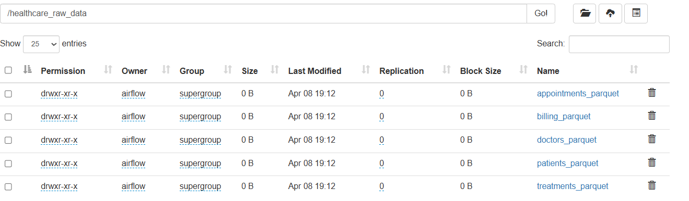
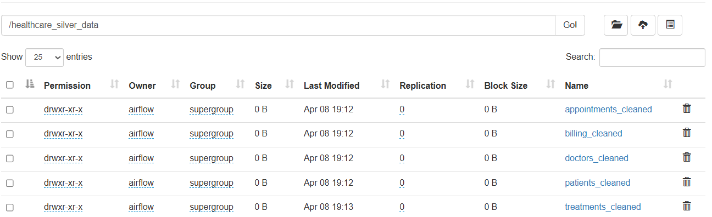
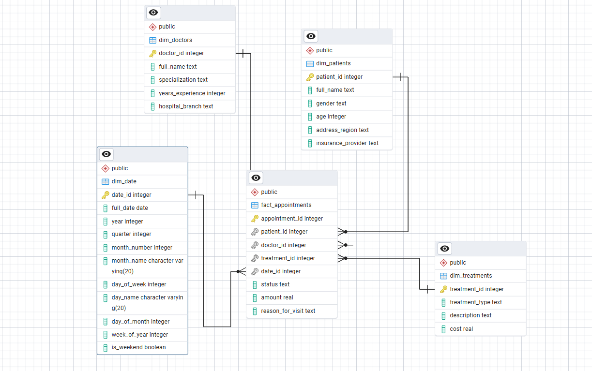
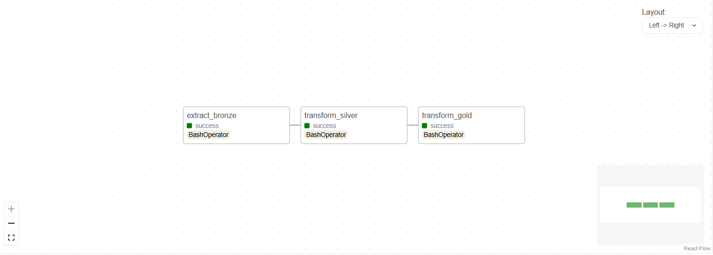

# 🏥 End-to-End Healthcare Data Engineering Pipeline
### Automated Medallion Architecture (Bronze → Silver → Gold) using Airflow, Spark, and Hadoop

## 🌟 Project Overview
This project demonstrates a production-grade data pipeline for a **Healthcare Management System**. It automates the transition from fragmented, raw CSV data into a fully modeled **Star Schema Data Warehouse**. 

The solution addresses the challenges of data isolation, quality issues, and manual processing by orchestrating a containerized ecosystem that ensures data integrity and scalability.

---

## 🏗️ Technical Architecture
The pipeline follows the **Medallion Architecture**, ensuring that data is refined at every stage:

1.  **Bronze (Raw Layer):** Ingests raw CSVs into **HDFS** in Parquet format to preserve an immutable "Source of Truth."
2.  **Silver (Cleaned Layer):** PySpark cleanses the data, standardizes Business IDs (e.g., `D101` → `101`), and handles schema enforcement.
3.  **Gold (Curated Layer):** Data is modeled into **Dimension and Fact tables** and loaded into **PostgreSQL** for analytical readiness.

> [!TIP]
> **Infrastructure as Code:** The entire stack (Hadoop, Spark, Airflow, Postgres) is containerized via Docker for 100% reproducibility.

---

## 🛠️ Tech Stack
* **Orchestration:** Apache Airflow
* **Data Processing:** Apache Spark (PySpark)
* **Distributed Storage:** Hadoop HDFS
* **Database (DW):** PostgreSQL
* **Infrastructure:** Docker & Docker Compose
* **Development:** Jupyter Notebooks (for Prototyping)

---

## 🔄 Pipeline Workflow
- this discribe the wholde pipeline:
- **Visual:** 
### 1. Extraction & Ingestion (Bronze)
- **Action:** Pulls 5 core datasets (`Patients`, `Doctors`, `Appointments`, `Billing`, `Treatments`).
- **Optimization:** Converted to **Parquet** to leverage columnar storage and reduce HDFS footprint.
- **Visual:** 

### 2. Transformation & Cleaning (Silver)
- **ID Standardization:** Used `regexp_replace` to convert alphanumeric Business IDs into Integers for high-performance indexing.
- **Data Quality:** Removed duplicates, handled NULLs in critical columns, and standardized date formats.
- **Visual:** 

### 3. Dimensional Modeling (Gold)
- **Star Schema:** Restructured data into a centralized **Fact Table** (`fact_appointments`) surrounded by descriptive **Dimension Tables**.
- **Time Intelligence:** Generated an automated `dim_date` to enable yearly, monthly, and weekly clinical trend analysis.
- **Database Integrity:** Implemented Primary and Foreign Keys in PostgreSQL after the initial Spark load to ensure relational consistency.
- **Visual:** 

### 4. Automation (Airflow DAG)
- **Orchestration:** A multi-step DAG ensures that transformations only happen after successful ingestion.
- **JDBC Connectivity:** Integrated Spark with PostgreSQL using explicit JAR driver management.
- **Visual:** 

---

## 📁 Repository Structure
```text
.
├── dags/                   # Airflow DAG definitions
├── scripts/                # PySpark ETL scripts (Extract, Transform, Load)
├── sql/                    # SQL scripts for Schema & Constraints
├── data/                   # Sample raw CSV datasets
├── drivers/                # Database connectors (PostgreSQL JDBC)
├── docker-compose.yaml     # Full stack orchestration
├── Dockerfile              # Custom Airflow image with Java & Spark

## 🚀 How to Run

### 1. Spin up the Environment

First, build and start all containers (Hadoop, Spark, Airflow, Postgres):

```bash
docker-compose up --build -d
```

---

### 2. Initialize Database Schema (CRITICAL)

Before running the Airflow pipeline, you must initialize the PostgreSQL schema. This script sets up the database, creates the necessary tables, and defines the Star Schema relationships (Primary & Foreign Keys).

* Open pgAdmin at: http://localhost:8085
* Login with: `admin@admin.com` / `admin`
* Connect to the `postgres_general` server
* Open the Query Tool on your target database (`hospital_db`)
* Copy and execute the content of `sql/schema.sql`

> [!IMPORTANT]
> This step ensures that when Spark begins the Gold Layer load, the target tables already have the correct relational structure and constraints.

---

### 3. Trigger the Pipeline

* Access the Airflow UI at: http://localhost:8089 (`Admin` / `Admin`)
* Locate the `healthcare_pipeline` DAG
* Unpause the DAG and click **Trigger DAG**

---

### 4. Monitor & Verify

* Monitor the task progress in Airflow's **Graph View**
* Once the `gold_layer` task is finished, go back to pgAdmin
* Query your final **Fact** and **Dimension** tables
